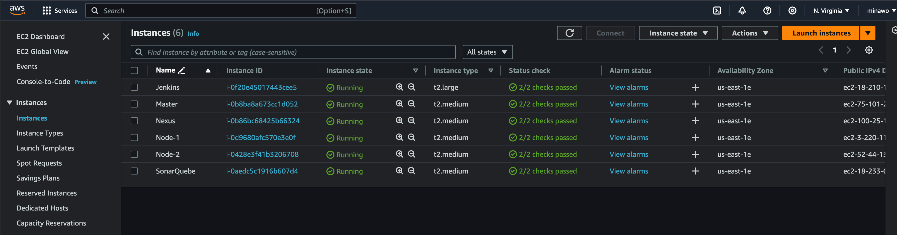
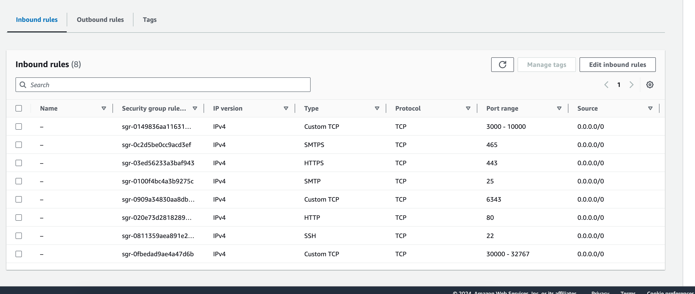
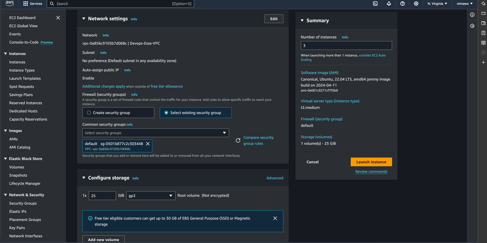
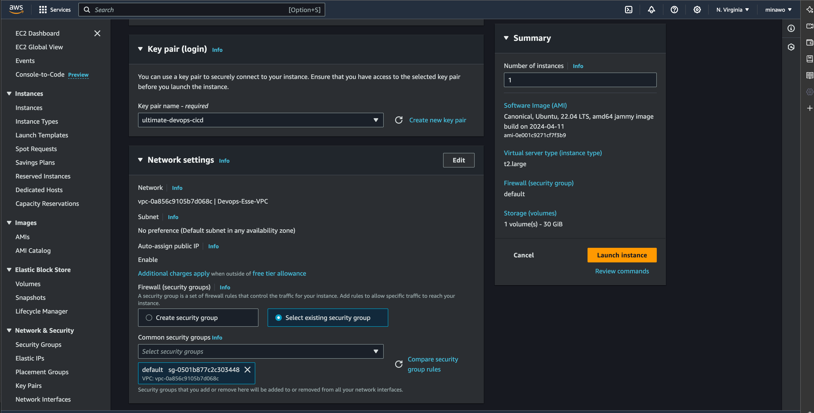

# AWS Infrastructure Setup



## Table of Contents
1. [Kubernetes Instances](#kubernetes-instances)
2. [SonarQube Instance](#sonarqube-instance)
3. [Nexus Instance](#nexus-instance)
4. [Jenkins Instance](#jenkins-instance)


### Networking

1. Navigate to the EC2 dashboard > Network & Security > Security Groups.
2. Create a new security group with the following settings:



### Key Pair
A key pair consists of a public key that AWS stores, and a private key file that you store. Together, they allow you to securely connect to your instance.

Go to the EC2 dashboard > Network & Security > Key Pairs.
Create a new key pair.
Download the private key file (.pem) and keep it secure. You will need it to connect to your EC2 instances.

### Kubernetes Instances

1. Create 3 EC2 instances.
2. Use the following AMI:
    - **Software Image (AMI):** Canonical, Ubuntu, 22.04 LTS, amd64 jammy (ami-0e001c9271cf7f3b9)
3. Ensure the following configurations:
    - Security group
    - Key pair
    - 20 GB volume
4. Rename the instances to:
    - Master
    - Node-1
    - Node-2



### SonarQube Instance

1. Create 1 EC2 instance similar to the Kubernetes instances with the name sonaqube

### Nexus Instance

1. Create 1 EC2 instance similar to the Kubernetes instances with the name sonarquebe

### Jenkins Instance

1. Create 1 EC2 instance with the following specifications:



### Note

Consider setting up an Elastic IP address to avoid changing IP addresses after a stop/restart.

### Connect to Your Instances

- **MacOS/Linux:** Use Zoc8
- **Windows:** Use MobaXterm

1. add your key as ssh key
2. username is ubuntu 
3. add your instance ip and chose port 22

```bash
ssh -i /path/to/your-key-pair.pem ubuntu@your-instance-public-dns
```

Replace /path/to/your-key-pair.pem with the path to your downloaded key pair file and your-instance-public-dns with the public DNS of your EC2 instance