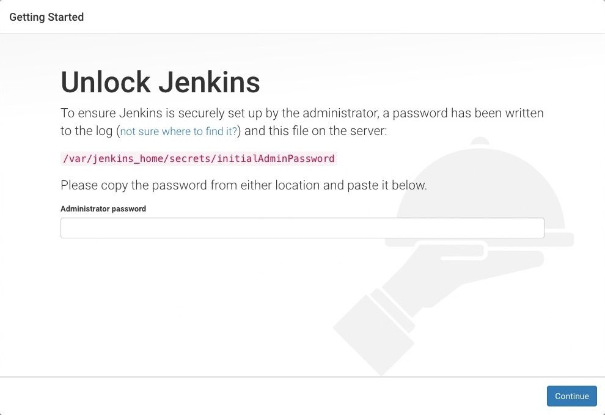

# Jenkins

 Update the server package

```shell
sudo apt update
```

### 1. Install Java 17 

```shell
# Install OpenJDK 17 JRE Headless
sudo apt install openjdk-17-jre-headless -y
```


### 2. Install Jenkins

```shell
# Download Jenkins GPG key
sudo wget -O /usr/share/keyrings/jenkins-keyring.asc \
  https://pkg.jenkins.io/debian-stable/jenkins.io-2023.key

# Add Jenkins repository to package manager sources
echo deb [signed-by=/usr/share/keyrings/jenkins-keyring.asc] \
  https://pkg.jenkins.io/debian-stable binary/ | sudo tee \
  /etc/apt/sources.list.d/jenkins.list > /dev/null

# Update package manager repositories
sudo apt-get update

# Install Jenkins
sudo apt-get install jenkins -y
```


1. #### Browse to http://localhost:8080
    
    
    
2. #### Get the password

```shell
sudo cat /var/lib/jenkins/secrets/initialAdminPassword `
```
   
Install suggested plugins


### 3. Install docker
```bash
#!/bin/bash

# Update package manager repositories
sudo apt-get update

# Install necessary dependencies
sudo apt-get install -y ca-certificates curl

# Create directory for Docker GPG key
sudo install -m 0755 -d /etc/apt/keyrings

# Download Docker's GPG key
sudo curl -fsSL https://download.docker.com/linux/ubuntu/gpg -o /etc/apt/keyrings/docker.asc

# Ensure proper permissions for the key
sudo chmod a+r /etc/apt/keyrings/docker.asc

# Add Docker repository to Apt sources
echo "deb [arch=$(dpkg --print-architecture) signed-by=/etc/apt/keyrings/docker.asc] https://download.docker.com/linux/ubuntu \
$(. /etc/os-release && echo "$VERSION_CODENAME") stable" | \
sudo tee /etc/apt/sources.list.d/docker.list > /dev/null

# Update package manager repositories
sudo apt-get update

sudo apt-get install -y docker-ce docker-ce-cli containerd.io docker-buildx-plugin docker-compose-plugin 

```

Save this script as **install_docker.sh**, then

```shell
sudo chmod +x install_docker.sh
```
Then run it

```bash
./install_docker.sh
```

### 4. Install Trivy for security check

```shell
sudo apt-get install wget apt-transport-https gnupg lsb-release
wget -qO - https://aquasecurity.github.io/trivy-repo/deb/public.key | gpg --dearmor | sudo tee /usr/share/keyrings/trivy.gpg > /dev/null
echo "deb [signed-by=/usr/share/keyrings/trivy.gpg] https://aquasecurity.github.io/trivy-repo/deb $(lsb_release -sc) main" | sudo tee -a /etc/apt/sources.list.d/trivy.list
sudo apt-get update
sudo apt-get install trivy
```
Save this script as **trivy.sh**, then

```shell
sudo chmod +x trivy.sh
```
Then run it

```bash
./trivy.sh
```


### 5. Install kubectl

```shell
curl -o kubectl https://amazon-eks.s3.us-west-2.amazonaws.com/1.19.6/2021-01-05/bin/linux/amd64/kubectl
chmod +x ./kubectl
sudo mv ./kubectl /usr/local/bin
kubectl version --short --client
```

Save this script as **kube.sh**, then

```shell
sudo chmod +x kube.sh
```
Then run it

```bash
./kube.sh
```

