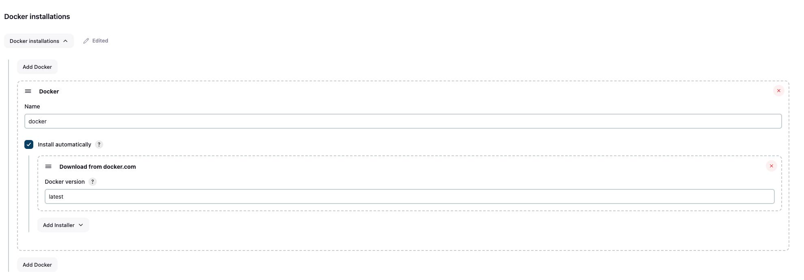

# **Jenkins Pipeline**


## 1. Setup Spring boot project and github repository

```textmate
https://github.com/esse-jacques-dansomon/springSchoolManagement
```


## 2. Install Plugins in Jenkins

1. **Eclipse Temurin Installer**:
    - Automatically install and configure the Eclipse Temurin JDK.

2. **Pipeline Maven Integration**:
    - Provides Maven support for Jenkins Pipeline.

3. **Config File Provider**:
    - Manage configuration files centrally in Jenkins.

4. **SonarQube Scanner**:
    - Integrate Jenkins with SonarQube for code analysis.

5. **Kubernetes CLI**:
    - Interact with Kubernetes clusters using `kubectl`.

6. **Kubernetes**:
    - Run Jenkins agents as pods within a Kubernetes cluster.

7. **Docker**:
    - Integrate Jenkins with Docker for builds and registry interactions.

8. **Docker Pipeline Step**:
    - Extend Jenkins Pipeline with Docker build, publish, and run steps.

**Steps to Install:**
1. Go to Jenkins dashboard -> Manage Jenkins -> Manage Plugins -> Available tab.
2. Search for each plugin by name.
3. Select and install each plugin without restarting.

After installing, configure the plugins as needed in Jenkins global configuration or job configurations.

You're right, there's no need to repeat those steps for each type of credential. Here’s a simplified and more concise version:

## 3. Configuration of the system 
Go to Dashboard > Manage Jenkins  > System

### Jenkins Location

### SonarQube servers


## 4. Configuration of the tools
Go to Dashboard > Manage Jenkins > System


1. ### JDK installations

2. ### SonarQube Scanner installations

3. ### Maven installations

4. ### Docker installations


## 5. Creating Credentials

### Common Steps

For each credential type, follow these initial steps:
1. Go to Jenkins dashboard -> Manage Jenkins -> Manage Credentials.
2. Select the appropriate domain (e.g., Global).
3. Click on "Add Credentials".

### 1. **GitHub**
1. Choose "Username with password" or "Secret text" based on your preference.
2. Enter your GitHub username and token/password and set id to **git-cred**
3. Click "OK".

### 2. **Docker**
1. Choose "Username with password".
2. Enter your Docker registry username and password. Set id to **docker-cred**
3. Click "OK".

### 3. **SonarQube Token**
#### Token
1. Generate a token in your SonarQube account. Set id to **sonar-cred**
2. Choose "Secret text".
3. Enter the generated SonarQube token.
4. Click "OK". 
#### webhook
1. Go to Administration > Configuration > Webhooks and create a webhook for jenkins 
2. add : http://jenkins_ip:webhook/

### 4. **Kubernetes**
1. Create a Kubernetes secret using the following YAML configuration: 

 ```yaml
 apiVersion: v1
 kind: Secret
 type: kubernetes.io/service-account-token
 metadata:
   name: mysecretname
   annotations:
     kubernetes.io/service-account.name: myserviceaccount
 ```

2. Save this as **service-account-token.yml**, then run:

 ```bash
 kubectl -n YOUR_NAMESPACE create -f service-account-token.yml
 ```

3. Retrieve the token from the created secret:

```bash
kubectl -n YOUR_NAMESPACE describe secret mysecretname
```

Look for the `token` field in the output and copy its value.

4. In Jenkins, choose "Secret text".
5. Paste the token value retrieved from the Kubernetes secret. Set id as **k8s-cred**
6. Click "OK"

##  6. Pipeline

```groovy
pipeline {
   agent any

   tools {
      jdk 'jdk17'
      maven 'maven3'
   }

   environment {
      SCANNER_HOME= tool 'sonar-scanner'
   }

   stages {
      stage('Git Checkout') {
         steps {
            git branch: 'main', credentialsId: 'github-esse-jacques-dansomon', url: 'https://github.com/esse-jacques-dansomon/springSchoolManagement'
         }
      }

      stage('Compile') {
         steps {
            sh "mvn compile"
         }
      }

      stage('Tests') {
         steps {
            sh "mvn test"
         }
      }

      stage('File System Scan') {
         steps {
            sh "trivy fs --format table -o trivy-fs-report.html ."
         }
      }

      stage('SonarQuebe Analysis') {
         steps {
            withSonarQubeEnv("sonar") {
               sh ''' $SCANNER_HOME/bin/sonar-scanner -Dsonar.projectName=schoolManagement -Dsonar.projectKey=schoolManagement \
                            -Dsonar.java.binaries=. '''
            }
         }
      }

      stage('Quality Gate') {
         steps {
            script {
               waitForQualityGate abortPipeline: false, credentialsId: 'sonar-token'
            }
         }
      }


      stage('Build') {
         steps {
            sh "mvn package"
         }
      }


      stage('Publish to nexus ') {
         steps {
            withMaven(globalMavenSettingsConfig: 'global-settings', jdk: 'jdk17', maven: 'maven3', mavenSettingsConfig: '', traceability: true) {
               sh "mvn deploy"
            }
         }
      }

      stage('Build & Tag Docker Image') {
         steps {
            script {
               withDockerRegistry(credentialsId: 'docker-cred', toolName: 'docker') {
                  sh "docker build -t essejacquesdansomon/school_management:latest ."
               }
            }
         }
      }

      stage('Docker Image Scan') {
         steps {
            sh "trivy image --format table -o trivy-fs-report.html essejacquesdansomon/school_management:latest"
         }
      }

      stage('Push Docker Image') {
         steps {
            script {
               withDockerRegistry(credentialsId: 'docker-cred', toolName: 'docker') {
                  sh "docker push essejacquesdansomon/school_management:latest"
               }
            }
         }
      }


      stage('Deploy to Kubernetes') {
         steps {
            withKubeConfig(caCertificate: '', clusterName: 'kubernetes', contextName: '', credentialsId: 'k8s-cred', namespace: 'webapps', restrictKubeConfigAccess: false, serverUrl: 'https://172.31.55.142:6443') {
               sh "kubectl apply -f ./k8s/app-deployment.yaml"
            }
         }
      }


      stage('Verify the Deployment') {
         steps {
            withKubeConfig(caCertificate: '', clusterName: 'kubernetes', contextName: '', credentialsId: 'k8s-cred', namespace: 'webapps', restrictKubeConfigAccess: false, serverUrl: 'https://172.31.55.142:6443') {
               sh "kubectl get pods -n webapps"
               sh "kubectl get svc -n webapps"
            }
         }
      }


   }
   post {
      always {
         script {
            def jobName = env.JOB_NAME
            def buildNumber = env.BUILD_NUMBER
            def pipelineStatus = currentBuild.result ?: 'UNKNOWN'
            def bannerColor = pipelineStatus.toUpperCase() == 'SUCCESS' ? 'green' : 'red'

            def body = """
                <html>
                <body>
                <div style="border: 4px solid ${bannerColor}; padding: 10px;">
                <h2>${jobName} - Build ${buildNumber}</h2>
                <div style="background-color: ${bannerColor}; padding: 10px;">
                <h3 style="color: white;">Pipeline Status: ${pipelineStatus.toUpperCase()}</h3>
                </div>
                <p>Check the <a href="${BUILD_URL}">console output</a>.</p>
                </div>
                </body>
                </html>
            """

            emailext (
                    subject: "${jobName} - Build ${buildNumber} - ${pipelineStatus.toUpperCase()}",
                    body: body,
                    to: 'essedansomon@gmail.com',
                    from: 'jenkins@jacques-dansomon.com',
                    replyTo: 'jenkins@jacques-dansomon.com',
                    mimeType: 'text/html',
                    attachmentsPattern: 'trivy-image-report.html'
            )
         }
      }
   }
}

```