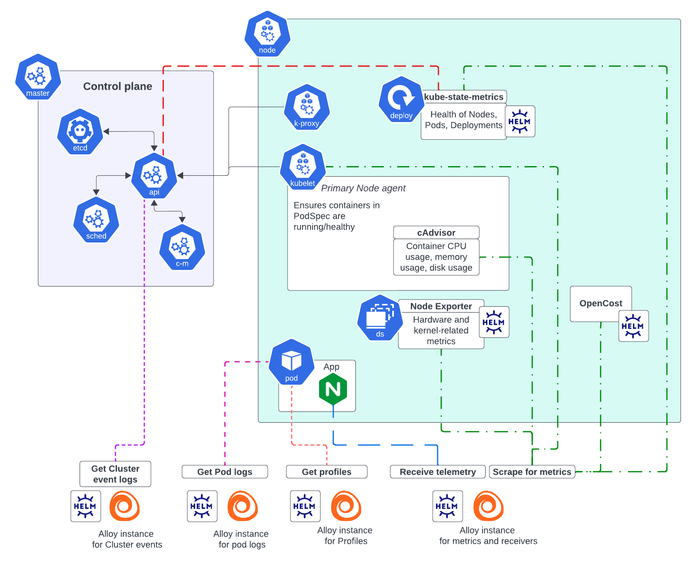

# Monitoring 

## 1- Create an Ec2 instance 
```
t2.medium, 20giga volume, ubuntu 22.04 with the name Monitor, 
```

## 2- Install prometheus 

```shell
apt update 
wget https://github.com/prometheus/prometheus/releases/download/v2.52.0/prometheus-2.52.0.linux-amd64.tar.gz
tar -xvf prometheus-2.52.0.linux-amd64.tar.gz 
rm prometheus-2.52.0.linux-amd64.tar.gz
cd prometheus-2.52.0.linux-amd64/
./prometheus &  
```

## 3- Install Grafana 

```shell
sudo apt-get install -y adduser libfontconfig1 musl
wget https://dl.grafana.com/enterprise/release/grafana-enterprise_10.4.0_amd64.deb
sudo dpkg -i grafana-enterprise_10.4.0_amd64.deb
sudo /bin/systemctl start grafana-server
```

## 4- Install BlackBox for WebSite monitoring

```shell
wget https://github.com/prometheus/blackbox_exporter/releases/download/v0.25.0/blackbox_exporter-0.25.0.linux-amd64.tar.gz
tar -xvf blackbox_exporter-0.25.0.linux-amd64.tar.gz
rm blackbox_exporter-0.25.0.linux-amd64.tar.gz
cd blackbox_exporter-0.25.0.linux-amd64/
./blackbox_exporter &
```

add black export to prometheus 

```shell
vi prometheus.yml 
```

```yaml
scrape_configs:
  # The job name is added as a label `job=<job_name>` to any timeseries scraped from this config.
  - job_name: "prometheus"

    # metrics_path defaults to '/metrics'
    # scheme defaults to 'http'.

    static_configs:
      - targets: ["localhost:9090"]

  - job_name: 'blackbox'
    metrics_path: /probe
    params:
      module: [http_2xx]  # Look for a HTTP 200 response.
    static_configs:
      - targets:
        - http://prometheus.io    # Target to probe with http.
        - https://prometheus.io   # Target to probe with https.
        - http://example.com:8080 # Target to probe with http on port 8080.
    relabel_configs:
      - source_labels: [__address__]
        target_label: __param_target
      - source_labels: [__param_target]
        target_label: instance
      - target_label: __address__
        replacement: 127.0.0.1:9115  # The blackbox exporter's real hostname:port.
  - job_name: 'blackbox_exporter'  # collect blackbox exporter's operational metrics.
    static_configs:
      - targets: ['127.0.0.1:9115']
```

## 5- Install Node Exporter on Ec2 instances you want to monitor 

```shell
wget https://github.com/prometheus/node_exporter/releases/download/v1.8.1/node_exporter-1.8.1.linux-amd64.tar.gz
tar -xvf node_exporter-1.8.1.linux-amd64.tar.gz 
rm node_exporter-1.8.1.linux-amd64.tar.gz
cd node_exporter-1.8.1.linux-amd64/
./node_exporter &
```

**Add node exporter to prometheus jobs**

```yaml
  - job_name: 'node_exporter_jenkins'  
    static_configs:
      - targets: ['ip-jenkins:port-jenkins']  
  - job_name: 'node_exporter_sonarqube'  
    static_configs:
      - targets: ['ip-sonar:ip-port']
```
**Add node Jenkins to prometheus jobs**

```yaml
  - job_name: 'jenkins' 
    metrics_path: '/prometheus'
    static_configs:
      - targets: ['100.26.151.53:8080']
```

**Restart prometheus after updating**

```shell
pgrep prometheus

kill $(pgrep prometheus) && ./prometheus &  
```

## 6. Grafana 
1. login 
2. add prometheus as Datasource 
3. import dashboards: blackbox_exporter and node_exporter


## Kubernetes Monitoring with Helm



### Install 

```shell
curl -fsSL -o get_helm.sh https://raw.githubusercontent.com/helm/helm/main/scripts/get-helm-3
chmod 700 get_helm.sh
./get_helm.sh
helm repo add Prometheus-community https://prometheus-community.github.io/helm-charts
helm repo update
helm show values prometheus-community/kube-prometheus-stack
helm install prometheus prometheus-community/kube-prometheus-stack --timeout 10m0s
```
