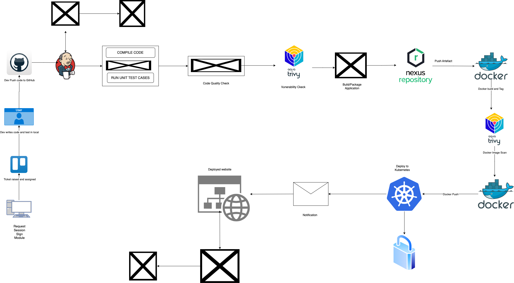

# Corporate CI/CD DevOps Pipeline

This repository outlines the setup of a complete CI/CD (Continuous Integration/Continuous Deployment) pipeline for corporate environments, leveraging AWS EC2 instances for infrastructure setup and deployment.

## Table of Contents
1. [Initial Setup](01_Initial_Setup/README.md)
2. [EC2 Instances Setup](02_EC2_Instances_Setup/README.md)
   - [AWS Setup](02_EC2_Instances_Setup/00_aws_setup/README.md)
   - [Kubernetes](02_EC2_Instances_Setup/01_kubernetes/README.md)
   - [SonarQube Instance](02_EC2_Instances_Setup/02_sonarqube/README.md)
   - [Nexus Instance](02_EC2_Instances_Setup/03_nexus/README.md)
   - [Jenkins Instance](02_EC2_Instances_Setup/04_jenkins/README.md)
3. [Jenkins Pipeline Setup](04_Jenkins_Pipeline_Setup/README.md)
4. [Monitoring Setup](05_Monitoring_Setup/README.md)

## Pipeline Components

- **Source Control**: GitHub
- **Build Tool**: Maven
- **Code Quality**: SonarQube
- **Security Scanning**: Trivy
- **Artifact Repository**: Nexus Repository
- **Containerization**: Docker
- **Orchestration**: Kubernetes 
- **CI/CD Server**: Jenkins
- **Monitoring**: Prometheus, Grafana
- **Notification**: Email notifications via Jenkins

## Acknowledgements

[DEVOPS SHACK](https://www.youtube.com/@devopsshack)